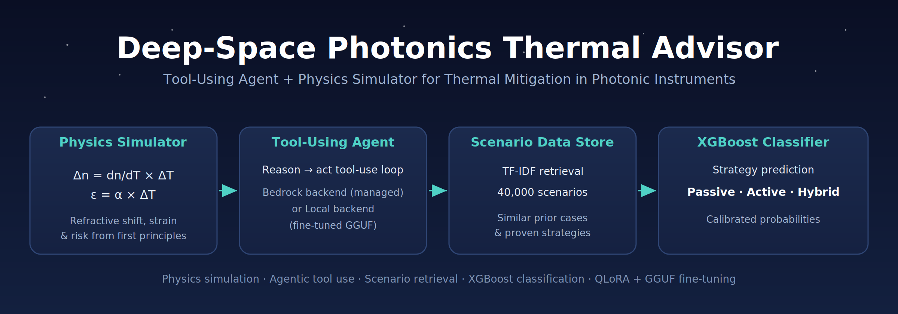

# 🛸 Deep Space Photonics Thermal Advisor

[](https://github.com/ATaylorAerospace/Thermal-Agent/actions/workflows/ci.yml)
[](https://www.python.org/)
[](https://aws.amazon.com/bedrock/)
[](https://huggingface.co/datasets/Taylor658/deep-space-optical-chip-thermal-dataset)
[](https://streamlit.io/)
[](https://xgboost.readthedocs.io/)
[](https://github.com/ggerganov/llama.cpp)
[](https://creativecommons.org/licenses/by/4.0/)
[](https://ataylor.getform.com/5w8wz)

> **A tool-using agent + physics simulator for recommending thermal mitigation strategies in deep space photonic instruments — runs on managed AWS Bedrock or a self-hosted, fine-tuned open-weight model**

*Physics simulation · Agentic tool use · Scenario retrieval · XGBoost classification · QLoRA + GGUF open-weight fine-tuning · Streamlit demo*

---

## 💡 The Problem

Photonic Integrated Circuits (PICs) are the backbone of next generation space probe instruments that operate in deep space — spectrometers, laser communication terminals, waveguide sensor arrays, and photonic signal processors. But space is brutal:

- **🌡️ Spectral drift** — temperature swings shift refractive indices, pushing resonant wavelengths off-target and corrupting measurements
- **📐 Waveguide misalignment** — differential thermal expansion between chip layers destroys optical coupling, killing signal throughput
- **💥 Mechanical cracking** — repeated thermal cycling fatigues bonding interfaces and dielectric layers until catastrophic failure

A spectrometer on a Jovian probe faces **180 K temperature swings**. An optical link in the outer solar system endures **240 K**. The wrong mitigation strategy means mission failure.

---

## ✨ The Solution

This project pairs **deterministic physics** with an **agent that reasons over a knowledge data store** — no fine-tuning required. A Bedrock foundation model decides which tools to call for any instrument-material-environment combination, then synthesizes a grounded recommendation:

| Layer | What It Does | Status |
|-------|-------------|--------|
| 🔬 **Physics Simulator** | Computes Δn and strain from first principles | ✅ Live |
| 🤖 **Tool-Using Agent** | Reasons over the scenario and calls tools via a pluggable backend | ✅ Live |
| ☁️ **Bedrock Backend** | Managed foundation model via the Converse API | ✅ Live |
| 🧠 **Open-Weight Backend** | Self-hosted Llama 3.3 / Qwen2.5 fine-tuned with QLoRA, served as GGUF | ✅ Live |
| 📚 **Scenario Data Store** | Retrieves similar prior cases from the 40K-scenario knowledge base | ✅ Live |
| 📊 **XGBoost Classifier** | Fast Passive / Active / Hybrid prediction with calibrated probabilities | ✅ Live |
| 🖥️ **Streamlit App** | Interactive two-mode demo (physics + agentic advisor) | ✅ Live |
| 🧪 **CI Pipeline** | Automated pytest across Python 3.10–3.12 on every push and PR | ✅ Live |

### Knowledge vs. behavior — two different jobs

- **Knowledge stays out of the weights.** The data store holds the facts; updating it means re-indexing, not re-training. Every recommendation cites real simulator output, classifier probabilities, and retrieved scenarios.
- **Behavior can be baked into the weights — for open-weight models.** You don't fine-tune to teach facts; you fine-tune so an open-weight model reliably emits this stack's tool calls without babysitting it with a giant system prompt. See [Open-Weight Fine-Tuning](#-open-weight-fine-tuning-qlora--gguf).
- **Composable** — the simulator, classifier, and data store are independent tools the model orchestrates on demand, regardless of backend.

---

## 🏗️ Architecture

### Runtime — agentic tool-use loop

```
                 ┌──────────────────────────────────────┐
                 │        Streamlit Interactive App      │
                 │   (Physics Simulator · Agentic Advisor)│
                 └──────────────────────────────────────┘
                                   │
                                   ▼
                 ┌──────────────────────────────────────┐
                 │              ThermalAgent             │
                 │       reason → act tool-use loop      │
                 └──────────────────────────────────────┘
                                   │
                   ┌───────────────┴───────────────┐
                   ▼                               ▼
        ┌────────────────────┐         ┌────────────────────────┐
        │   Bedrock backend  │         │      Local backend     │
        │   (managed FM via  │         │  (fine-tuned GGUF via  │
        │    Converse API)   │         │ OpenAI-compatible EP)  │
        └────────────────────┘         └────────────────────────┘
                   └───────────────┬───────────────┘
                                   ▼
                 ┌──────────────────────────────────────┐
                 │             ToolDispatcher            │
                 └──────────────────────────────────────┘
                     │              │               │
                     ▼              ▼               ▼
            ┌──────────────┐ ┌──────────────┐ ┌──────────────────┐
            │  simulate_   │ │  classify_   │ │ search_thermal_  │
            │  thermal_    │ │  strategy    │ │ knowledge        │
            │  drift       │ │  (XGBoost)   │ │ (data store)     │
            └──────────────┘ └──────────────┘ └──────────────────┘
                     │              │               │
                     ▼              ▼               ▼
            ┌──────────────┐ ┌──────────────┐ ┌──────────────────┐
            │ ThermalDrift │ │  Strategy    │ │ ThermalDataStore │
            │  Simulator   │ │  Classifier  │ │ TF-IDF · 40K rows│
            └──────────────┘ └──────────────┘ └──────────────────┘
```

The agent runs a **tool-use loop**: the model requests a tool, the `ToolDispatcher` executes it against the simulator, classifier, or data store, the result is fed back, and the loop repeats until the model returns a final recommendation. The **model backend is pluggable** — the same loop runs against managed Bedrock or a self-hosted fine-tuned open-weight model (the `LocalToolBackend` translates Bedrock Converse ↔ OpenAI tool-calling). The data store is likewise backend-agnostic — the local TF-IDF index can be swapped for **Amazon Bedrock Knowledge Bases** in production without changing the agent or tools.

### Offline — open-weight fine-tuning pipeline (feeds the Local backend)

```
   HuggingFace          training_data.py         finetune.py        quantize.py
   40K dataset    ──▶    SFT trace builder   ──▶  QLoRA 4-bit   ──▶  merge + GGUF   ──▶  GGUF
                        (real Strategy            (LoRA adapter)     (Q4_K_M)            served by
                         Classifier +                                                    Local backend
                         ThermalDataStore →
                         grounded tool traces)
```

The SFT builder runs the **real** `StrategyClassifier` and `ThermalDataStore` to ground each training trace in genuine tool outputs (with synthesized fallbacks for unseen inputs), so the fine-tuned open-weight model learns this stack's exact tool-calling dialect — not synthetic proxies.

---

## 📦 Dataset

**40,000 synthetic thermal scenarios** — [Taylor658/deep-space-optical-chip-thermal-dataset](https://huggingface.co/datasets/Taylor658/deep-space-optical-chip-thermal-dataset)

The dataset is the agent's **knowledge store**: scenarios are indexed for retrieval and used to train the XGBoost classifier.

### Chip Materials

| Material | dn/dT (K⁻¹) | α — Thermal Expansion (K⁻¹) | Sensitivity |
|----------|:------------:|:----------------------------:|:-----------:|
| **Silicon** | 1.86 × 10⁻⁴ | 2.6 × 10⁻⁶ | High |
| **Silicon Nitride** | 2.45 × 10⁻⁵ | 8.0 × 10⁻⁷ | Low |
| **Polymer** | 1.1 × 10⁻⁴ | 2.2 × 10⁻⁶ | Moderate |
| **Indium Phosphide** | 3.4 × 10⁻⁴ | 4.6 × 10⁻⁶ | Very High |

### Environments

| Environment | Expected ΔT (K) | Severity |
|-------------|:----------------:|:--------:|
| Near Earth Deep Space | 120 | ⚠️ Moderate |
| Mars Transit | 150 | ⚠️ Moderate |
| Jovian System | 180 | 🔴 High |
| Outer Solar System | 240 | 🔴 Critical |

### Coverage

- **4 instruments** — Spectrometer, Laser Communication Terminal, Waveguide Sensor Array, Photonic Signal Processor
- **3 strategy types** — Passive, Active, Hybrid

---

## 🚀 Quick Start

```bash
# Clone
git clone https://github.com/ATaylorAerospace/Thermal-Agent.git
cd Thermal-Agent

# Install
pip install -r requirements.txt

# Configure
cp .env.example .env
# → Edit .env with your AWS credentials (Bedrock access)

# Build the agent's knowledge artifacts:
#   - scenario data store (vector index)
#   - XGBoost strategy classifier
bash scripts/build_index.sh

# Run the interactive app
streamlit run app/streamlit_app.py
```

---

## 🔮 Usage Examples

### 1. Physics Simulation — Compute Thermal Risk

```python
from src.simulator import ThermalDriftSimulator

sim = ThermalDriftSimulator()

# Evaluate Indium Phosphide on a Jovian mission
result = sim.evaluate("Indium Phosphide", "Jovian System")

print(f"Δn = {result['delta_n']:.6f}")       # Δn = 0.061200
print(f"Strain = {result['strain']:.2e}")     # Strain = 8.28e-04
print(f"Risk: {result['risk']}")              # Risk: Critical
print(f"Strategy: {result['recommended_strategy_hint']}")  # Strategy: Hybrid
```

### 2. Scenario Retrieval — Query the Data Store

```python
from src.datastore import ThermalDataStore

store = ThermalDataStore.from_huggingface()  # or .load("results/thermal_datastore.pkl")

for hit in store.query("Indium Phosphide spectrometer Jovian spectral drift", top_k=3):
    print(f"{hit['similarity']:.3f}  {hit['instrument']} → {hit.get('strategy_type')}")
```

### 3. XGBoost Strategy Prediction

```python
from src.strategy_classifier import StrategyClassifier

clf = StrategyClassifier()
clf.load("results/strategy_classifier.pkl")

proba = clf.predict_proba(
    material="Silicon",
    instrument="Spectrometer",
    environment="Mars Transit",
    thermal_effect="Spectral Drift",
)
print(proba)
# {'Active': 0.12, 'Hybrid': 0.61, 'Passive': 0.27}
```

### 4. The Agent — Tool-Grounded Recommendation

```python
from src.agent import ThermalAgent

# Loads the data store and classifier from config/agent_config.yaml if present
agent = ThermalAgent.from_config()

result = agent.run(
    "Instrument: Laser Communication Terminal\n"
    "Material: Indium Phosphide\n"
    "Environment: Outer Solar System\n"
    "Thermal Effect: Waveguide Misalignment\n"
    "What thermal mitigation strategy should be used and why?"
)

print(result["answer"])        # the grounded recommendation
print(result["tool_calls"])    # every tool the agent invoked, with inputs + results
```

### 5. Build the Knowledge Artifacts

```bash
# One command — build the data store index and train the classifier
bash scripts/build_index.sh
```

---

## 🧠 Open-Weight Fine-Tuning (QLoRA → GGUF)

Run the same agent against a **self-hosted, fine-tuned open-weight model** instead of Bedrock. The point isn't to teach the model facts (the data store does that) — it's to make a raw open-weight model a **reliable, low-overhead tool-caller** for this exact stack:

- **Close the out-of-the-box gap** — off-the-shelf Llama 3.3 / Qwen2.5 are capable but loose at strict tool-call formatting. QLoRA bakes the call format in.
- **Teach your dialect** — the SFT traces encode *these* tool schemas and call patterns, so the model speaks your infrastructure natively.
- **Own your unit economics** — with the behavior in the weights you can strip the giant tool-description system prompt, cutting input-token overhead per inference.

### Pipeline

```bash
# Heavy deps on a GPU host (kept out of core requirements / CI)
pip install -r requirements-finetune.txt

# 1) Build agentic tool-calling SFT data  2) QLoRA fine-tune  3) merge + GGUF quantize
bash scripts/finetune_pipeline.sh
```

| Stage | Module | Output |
|-------|--------|--------|
| Build SFT traces | `src/training_data.py` | `data/finetune/{train,validation}.jsonl` |
| QLoRA fine-tune | `src/finetune.py` | LoRA adapter in `results/thermal-agent-lora/` |
| Merge + quantize | `src/quantize.py` | `results/thermal-agent.Q4_K_M.gguf` |

Base model, LoRA rank, 4-bit quantization, and the GGUF quant type are all set in [`config/finetune_config.yaml`](config/finetune_config.yaml) (defaults: Llama 3.3 70B, nf4 4-bit, `Q4_K_M`).

### Serve and switch the agent to it

Serve the GGUF behind any OpenAI-compatible endpoint (llama.cpp server, Ollama, or vLLM), then flip the provider in [`config/agent_config.yaml`](config/agent_config.yaml):

```yaml
agent:
  provider: local        # bedrock | local
local:
  model: thermal-agent
  base_url: http://localhost:8000/v1
```

`ThermalAgent.from_config()` now routes through `LocalToolBackend` — the rest of the agent loop is unchanged.

---

## 📁 Repository Structure

```
Thermal-Agent/
├── .github/
│   └── workflows/
│       └── ci.yml                   # GitHub Actions CI — pytest on 3.10–3.12
├── app/
│   └── streamlit_app.py             # Interactive two-tab demo
├── config/
│   ├── agent_config.yaml            # Agent provider, data store, classifier paths
│   └── finetune_config.yaml         # QLoRA + GGUF fine-tuning settings
├── docs/
│   └── thermals.png                 # Hero banner image
├── notebooks/
│   ├── 01_eda.ipynb                 # Exploratory data analysis
│   ├── 02_agent_walkthrough.ipynb   # End-to-end agent walkthrough
│   └── 03_open_weight_finetuning.ipynb  # QLoRA → GGUF walkthrough
├── results/                         # Model, index & adapter artifacts (gitignored)
├── scripts/
│   ├── build_index.sh               # Build data store + train classifier
│   └── finetune_pipeline.sh         # Build SFT data → QLoRA → GGUF
├── src/
│   ├── __init__.py                  # Public API exports
│   ├── agent.py                     # Tool-use agent (pluggable backend)
│   ├── backends.py                  # Local open-weight (OpenAI-compatible) backend
│   ├── tools.py                     # Tool specs + dispatcher
│   ├── datastore.py                 # Scenario retrieval (knowledge store)
│   ├── training_data.py             # Agentic SFT data builder
│   ├── finetune.py                  # QLoRA fine-tuning (Llama 3.3 / Qwen2.5)
│   ├── quantize.py                  # Adapter merge + GGUF quantization
│   ├── simulator.py                 # Physics-based thermal drift engine
│   └── strategy_classifier.py       # XGBoost Passive/Active/Hybrid
├── tests/
│   ├── __init__.py                  # Test package init
│   ├── test_agent.py                # Agent loop tests (mocked backend)
│   ├── test_backends.py             # Local backend translation tests
│   ├── test_tools.py                # Tool dispatch tests
│   ├── test_datastore.py            # Data store retrieval tests
│   ├── test_training_data.py        # SFT data builder tests
│   ├── test_classifier.py           # Classifier tests
│   └── test_simulator.py            # Physics simulator tests
├── .env.example                     # Credential / endpoint template
├── .gitignore
├── conftest.py                      # Pytest path configuration
├── CONTRIBUTING.md                  # Development setup & PR guidelines
├── README.md
├── requirements.txt                 # Core dependencies (agent + tests)
└── requirements-finetune.txt        # Heavy, optional fine-tuning dependencies
```

---

## 🧩 Components

### 🔬 Physics Simulator (`src/simulator.py`)
Computes **refractive index shift** (Δn = dn/dT × ΔT) and **mechanical strain** (ε = α × ΔT) for any material-environment pair. Classifies risk as **Low → Moderate → High → Critical** and maps to a strategy hint. Exposed to the agent as the `simulate_thermal_drift` tool.

### 📚 Scenario Data Store (`src/datastore.py`)
Indexes the 40K HuggingFace scenarios with TF-IDF and retrieves the most similar prior cases by cosine similarity. Backend-agnostic — swappable for Amazon Bedrock Knowledge Bases in production. Exposed as the `search_thermal_knowledge` tool.

### 🛠️ Agent Tools (`src/tools.py`)
Bedrock Converse tool specifications plus a `ToolDispatcher` that routes each tool call to the simulator, classifier, or data store. Tools backed by a missing artifact degrade gracefully.

### 🤖 Thermal Agent (`src/agent.py`)
A tool-using agent that runs a reason-act loop — requesting tools, feeding results back, and iterating — until it returns a grounded recommendation along with the full trace of tool calls. The model backend is pluggable (`provider: bedrock | local`).

### 🧠 Open-Weight Backend & Fine-Tuning (`src/backends.py`, `src/training_data.py`, `src/finetune.py`, `src/quantize.py`)
`LocalToolBackend` runs a self-hosted, QLoRA-fine-tuned Llama 3.3 / Qwen2.5 model (exported to GGUF) behind an OpenAI-compatible endpoint, translating Bedrock Converse ↔ OpenAI tool-calling so it drops straight into the agent loop. The fine-tuning trio builds agentic SFT traces, runs 4-bit QLoRA, and merges + quantizes the adapter to GGUF.

### 📊 Strategy Classifier (`src/strategy_classifier.py`)
XGBoost classifier predicting **Passive / Active / Hybrid** strategies with calibrated probability estimates. Exposed as the `classify_strategy` tool and usable standalone.

---

## 🧪 Testing

Tests run automatically via **GitHub Actions CI** on every push and pull request against Python 3.10, 3.11, and 3.12.

```bash
# Run all tests locally
pytest tests/ -v

# Run a single suite
pytest tests/test_agent.py -v
```

The agent tests use a scripted fake Bedrock client, so the full tool-use loop is exercised **without any AWS calls**.

---

## 🤝 Contributing

See [CONTRIBUTING.md](CONTRIBUTING.md) for development setup, testing instructions, and pull request guidelines.

---

## 📜 License

This work is licensed under [CC BY 4.0](https://creativecommons.org/licenses/by/4.0/).

Copyright (c) 2026 A Taylor

---

## 📬 Contact

Have questions, ideas, or want to collaborate? Reach out directly:

[](https://ataylor.getform.com/5w8wz)
